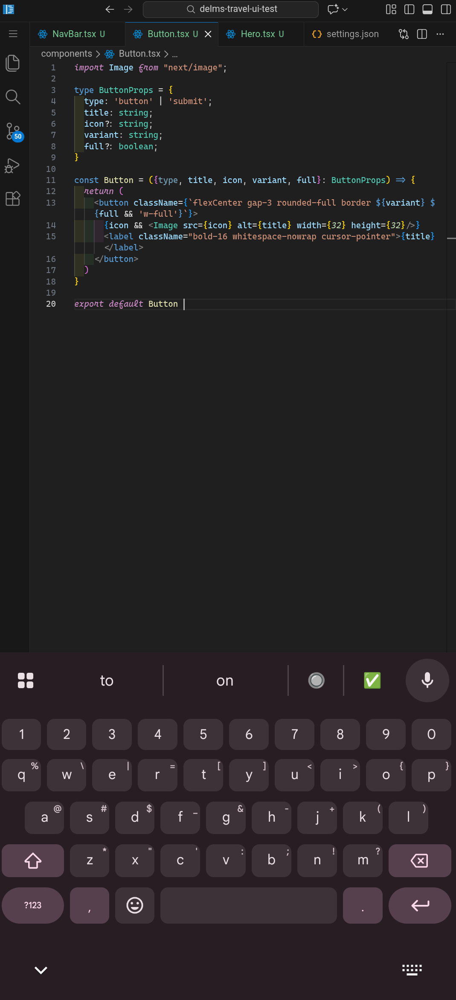

# Code Server Font Patch

This patch enables [code-server](https://github.com/cdr/code-server) to use **Cascadia Code** with **italic and cursive support**.

It works with **offline font files** and automatically injects the necessary `@font-face` rules to properly render italics and cursive glyphs.

---

## Screenshot



---

## Installation

1. Clone this repository:

```bash
git clone https://github.com/yourusername/code-server-font-patch.git
cd code-server-font-patch
```

2. Ensure you have the Cascadia Code font files in the `fonts/cascadia` folder next to the script:


```bash
fonts/cascadia/
├── CascadiaCode.woff2
└── CascadiaCodeItalic.woff2
```

3. Run the patch script. The script automatically detects your code-server installation path:

```bash
sudo ./patch.sh
```

> The script will copy the fonts to the code-server _static folder, inject the CSS, and back up workbench.html.
No manual editing of workbench.html or hardcoding of paths is required.


---

## Settings

After installation, configure your editor in settings.json to enable Cascadia Code with cursive italics:
```bash
{
  "editor.fontFamily": "'Cascadia Code', monospace",
  "terminal.integrated.fontFamily": "'Cascadia Code', monospace",
  "editor.fontLigatures": "'calt', 'ss01'"
}
```
`'calt', 'ss01'` enables Cascadia Code’s cursive italic glyphs.

Optional: add `'ss02'` for additional stylistic flourishes.


---

## Verification

1. Open code-server and check comments or italic tokens — letters like **f, k, y** should appear **curvy/cursive**.


2. Open Developer Tools → Network → Font to confirm:


```bash
CascadiaCode.woff2       → 200 OK
CascadiaCodeItalic.woff2 → 200 OK
```

---

## Notes

Fonts are served offline — no Google Fonts dependency.

Works on any Linux system or Termux environment.

Safe for re-use — workbench.html is backed up before CSS injection.
