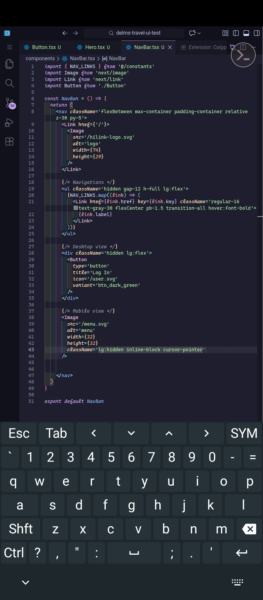

# Code Server Font Patch

This patch enables [code-server](https://github.com/cdr/code-server) to use [Cascadia Code](https://github.com/microsoft/cascadia-code) with **italic and cursive support**.

It works with **offline font files** and automatically injects the necessary `@font-face` rules to properly render italics and cursive glyphs.

---

## Screenshots
**code-server running on termux proot-distro (Ubuntu)**
<p align="center">
  
  
</p>

---

## Installation

1. Clone this repository:

```bash
git clone https://github.com/delmsyap/code-server-font-patch-cascadia.git
cd code-server-font-patch-cascadia
```

2. Cascadia Code font files are located in the `fonts/cascadia` folder next to the script:


```bash
fonts/cascadia/
├── CascadiaCode.woff2
└── CascadiaCodeItalic.woff2
```

3. Run the patch script. The script automatically detects your code-server installation path:

```bash
❯ chmod +x patch.sh
❯ ./patch.sh

[*] Installing existing Cascadia Code fonts
[*] Copying fonts
[*] Backing up workbench.html
[*] Injecting @font-face
[✓] Cascadia Code installed successfully

👉 Add this to settings.json:
{
  "editor.fontFamily": "'Cascadia Code', monospace",
  "editor.fontLigatures": "'calt', 'ss01'"
}
```

> The script will copy the fonts to the code-server _static folder, inject the CSS, and back up workbench.html.
No manual editing of workbench.html or hardcoding of paths is required.


---

## Settings

After installation, configure your editor in settings.json to enable Cascadia Code with cursive italics:
```json
{
  "editor.fontFamily": "'Cascadia Code', monospace",
  "terminal.integrated.fontFamily": "'Cascadia Code', monospace",
  "editor.fontLigatures": "'calt', 'ss01'"
}
```
`'calt', 'ss01'` enables Cascadia Code’s cursive italic glyphs.

Optional: add `'ss02'` for additional stylistic flourishes.


---

## Verification

1. Open code-server and check comments or italic tokens — letters like **f, k, y** should appear **curvy/cursive**.


2. Open Developer Tools → Network → Font to confirm:


```bash
CascadiaCode.woff2       → 200 OK
CascadiaCodeItalic.woff2 → 200 OK
```


3. or test it directly with `curl` to confirm if fonts are loaded successfully:
```bash
❯ curl -I http://localhost:8080/_static/src/browser/media/fonts/CascadiaCode.woff2

HTTP/1.1 200 OK
Accept-Ranges: bytes
Cache-Control: public, max-age=0
Last-Modified: Thu, 29 Jan 2026 12:36:22 GMT
ETag: W/"356c8-19c09c131d9"
Content-Type: font/woff2
Content-Length: 218824
Date: Thu, 29 Jan 2026 17:41:49 GMT
Connection: keep-alive
Keep-Alive: timeout=5


❯ curl -I http://localhost:8080/_static/src/browser/media/fonts/CascadiaCodeItalic.woff2

HTTP/1.1 200 OK
Accept-Ranges: bytes
Cache-Control: public, max-age=0
Last-Modified: Thu, 29 Jan 2026 12:36:22 GMT
ETag: W/"27010-19c09c131d1"
Content-Type: font/woff2
Content-Length: 159760
Date: Thu, 29 Jan 2026 17:47:12 GMT
Connection: keep-alive
Keep-Alive: timeout=5
```

---

## Notes

**Fonts are served offline** — no Google Fonts dependency.

**Works on any Linux system or Termux environment.**

**Safe for re-use** — workbench.html is backed up before CSS injection.
